<a name="readme-top"></a>
<h1>                </h1>

<div align="center">            </div>

 </img> 
<br>
<h2>Proyecto de GitHub</h2>

# Tabla de contenidos
[⚙️ Configuración](Ajustes)

[📱Acerca de nosotros]()

[📥Instalación]()

[👇Uso]()

[👨‍🔧Soporte técnico]()

# [Proyecto de GitHub] <a name="Acerca del proyecto" > </a>

**[Proyecto de GitHub]** Es el primer proyecto del SENA, como gestión de redes de datos

## 🔨 Construido con <a name="built-with"></a>
<p>
Este proyecto se hizo usando:
HTML, Markdown, Shellscript, Git, GitHub </p>

### Herramientas <a name="Herramientas"></a>

<li>HTML</li>
<li>Markdown</li>
<li>Shellscript</li>
<li>Git</li>
<li>GitHub</li>


<details>
<summary> Client </summary>
    <ul>
    <li><a href="https://developer.mozilla.org/es/docs/Web/HTML">HTML</a></li>    
    </ul>
</details>

<details>
<summary>Markdown</summary>
<ul>
<li><a href="https://markdown.es/sintaxis-markdown/">Markdown</a></li>
</ul>
</details>


### Configuración

Para clonar este repositorio:

```sh
cd 
git clone https://github.com/danieljr95/document.git
```
### Para ejeucurarlo, usamos

Install This project with:

```sh
    ./README.md
```

### Comandos creados en shell para Windows

Para correr los comandos, podemos descargar el archivo del repositorio y ejecutarlo en git bash con un ./ :

git clone https://github.com/danieljr95/net.git

O puede copiar y pegar lo siguente:

```sh
#!/bin/bash

# Para pedir una IP
echo "Pedir al usuario una dirección IP"
read -p "Introduce una dirección IP " ip_address

# Mostrar IP ingresada

echo "La dirección IP ingresada es: $ip_address"

# Info del sistema
echo "Info del sistema:"
systeminfo

# Mostrar lista de procesos en ejeucion
echo "Lista de procesos:"
tasklist 
```


<p align="right"><a href="#readme-top">Back to top</a></p>

## 👥 Authors <a name="authors"></a>

Daniel Jara

🧑🏻‍💻 **Author 1**

 - GitHub: [@danieljr95](https://github.com/alyconr)


## 📃 Creación de actividad 1 <a name="license"></a>

Creamos la rama develop con: git checkout -b develop

A continuación, creamos una rama llamada featue-1 y añadimos una clase A con atributos: foo bar.

Para mejor orden, creamos un archivo nuevo llamado a.js, lo añadimos con git add a.js, comentamos los cambios realizados en el documento con git commit -m "Añadida clase A con atributos foo, bar, y javascript"
y lo subimos con git push feature-1

Creamos un archivo a.js, indicando que es para Javascript:
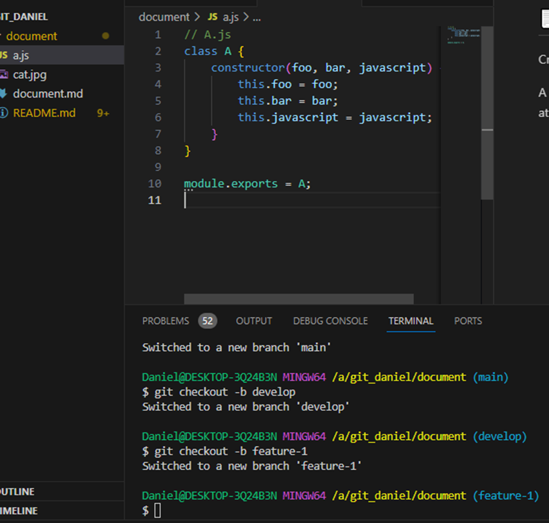
Repetimos las acciones anteriores, con git add, git commit y git push.
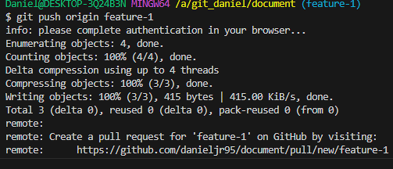
Posteriormente lo mergeamos con la rama develop, y un push para subir los cambios.
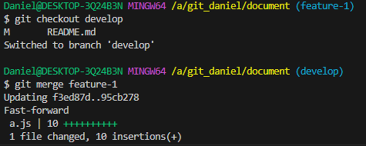
A continuación mergeamos la rama develop con Main, y generamos una etiqueta llamada v1.0:
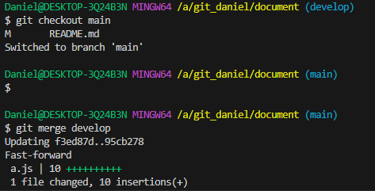
Etiqueta y push, especificando al final los tags para subirlos:
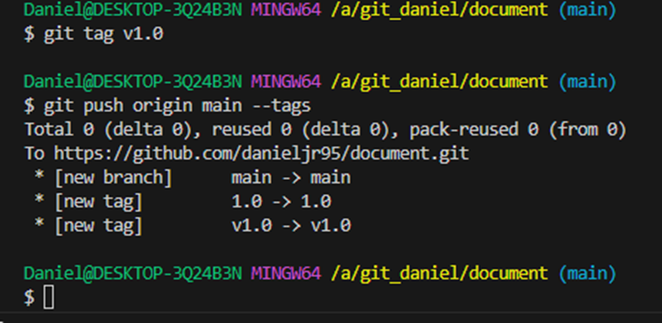
Creamos la rama feature-2 y añadimos la clase B, que es un archivo similar al A, solo cambiando los valores del foo y creando un b.js:
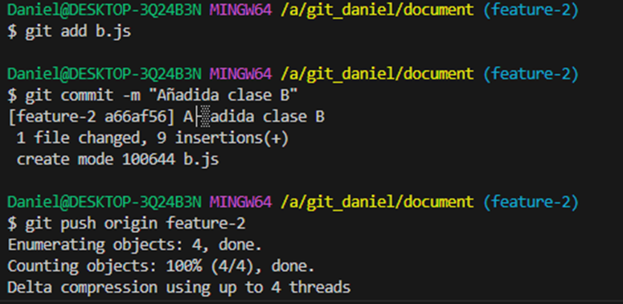
Creación:
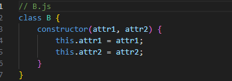
Nuevamente creamos otra rama nombrada feature-3, y añadimos una clase C:
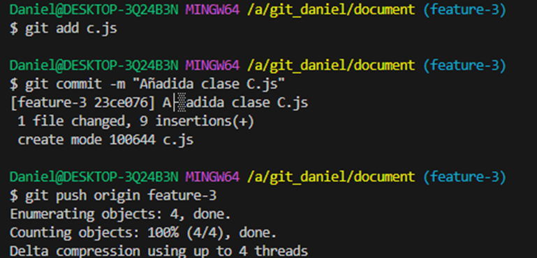
Archivo c.js
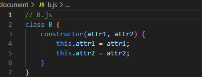
Mergeamos featute-2 y feature-3 con develop:
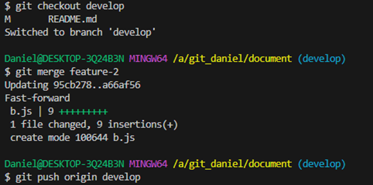
Mergeamos develop con main y creamos una nueva etiqueta v2.0:
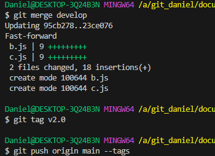
Creación de rama hotfix-1 a partir de main y añadir un atributo lorem en clase A:
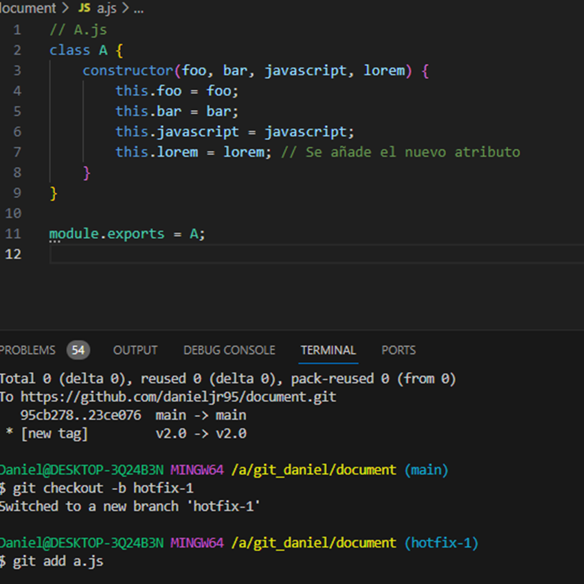
Mergear rama hotfix-1 con main y creación de etiqueta v2.1:
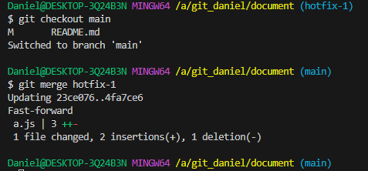
Tag:
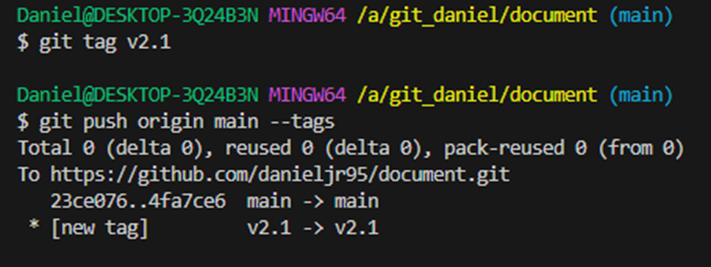


<p align="right"><a href="#readme-top">Back to top</a></p>